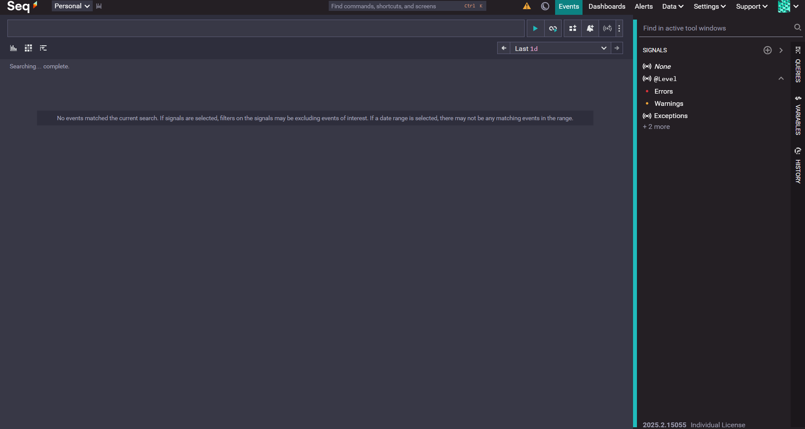
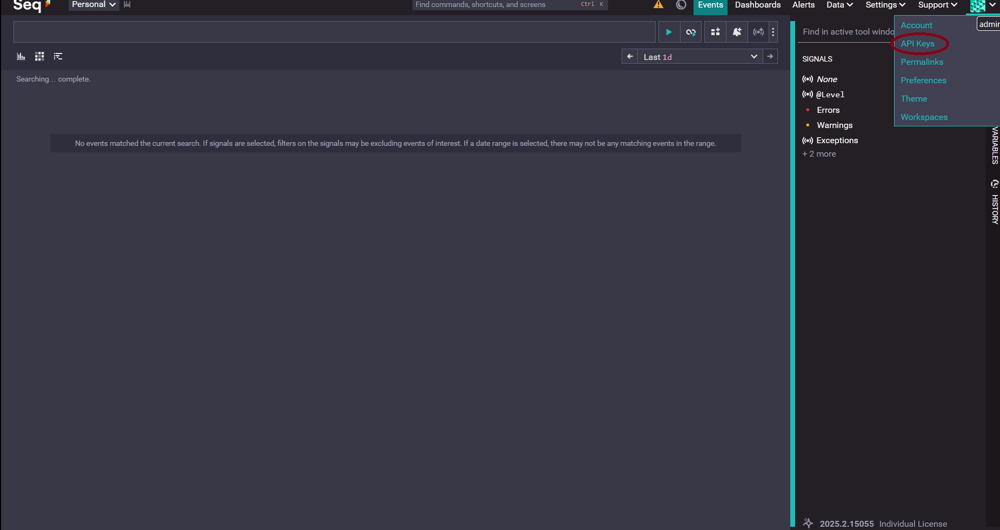
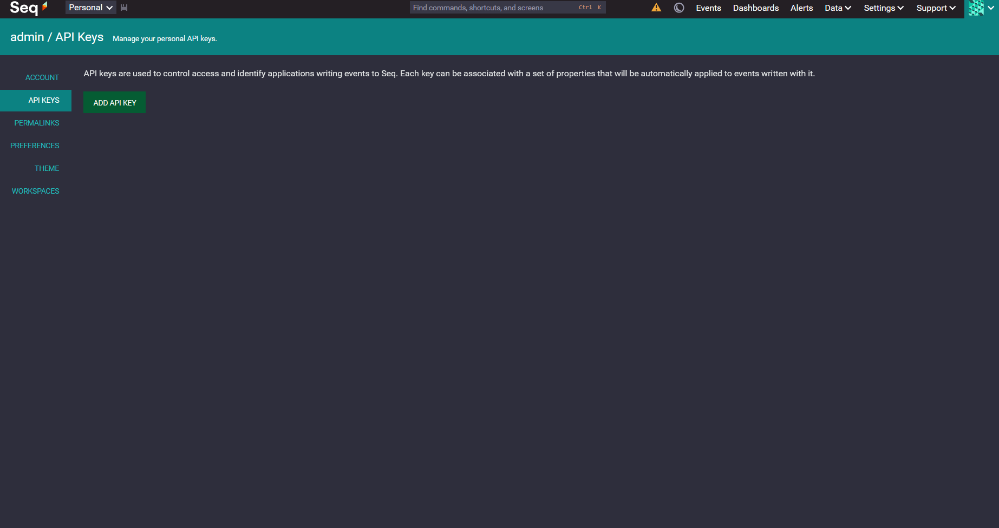
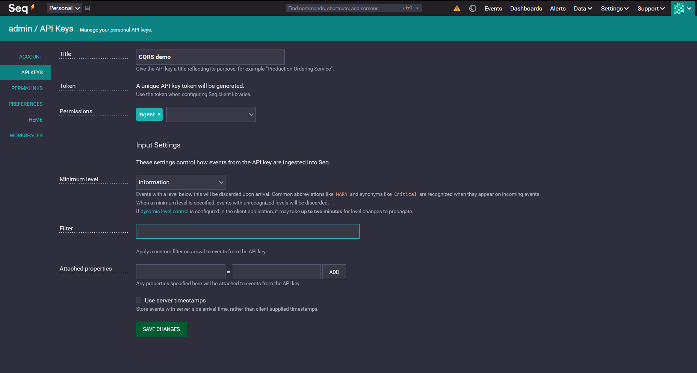

# group-05-CQRS-synchronization
## Introduction
### What is it?
This project provides a synchronization system between databases that can be used inside a Command Query Responsibility Segregation (CQRS) context where the query and command sides are split up into 2 different databases.

### For who?
Developers building applications with:
- separated databases for command and query
- need for a reliable data synchronization.

### Why use it?
- Easy to use
  - Setup with docker image, plug and play.
- Reliable
  - Lose no data between the databases.
- Independent
  - The used databases can be swapped for another type when correctly implemented.

By Youri Haentjens, Pratik Lohani, Lander Debeir & Matse De Deyn

## Contents
- [group-05-CQRS-synchronization](#group-05-cqrs-synchronization)
  - [Introduction](#introduction)
    - [What is it?](#what-is-it)
    - [For who?](#for-who)
    - [Why use it?](#why-use-it)
  - [Contents](#contents)
  - [Quick start](#quick-start)
  - [Features](#features)
  - [Usage](#usage)
  - [Configuration](#configuration)
    - [Example .env](#example-env)
    - [How to get SEQ api key](#how-to-get-seq-api-key)
  - [Tests](#tests)
  - [Troubleshooting](#troubleshooting)
    - [Databases are not yet started](#databases-are-not-yet-started)
    - [Events are formatted incorrectly](#events-are-formatted-incorrectly)
      - [Examples wrong event formation](#examples-wrong-event-formation)
    - [New events are not getting processed](#new-events-are-not-getting-processed)
  - [Demo](#demo)
  - [Links](#links)

## Quick start

In order to utilize the application you have to do the following steps:

1. Clone the project to a local space
```bash
git clone git@github.com:howest-ti-sep/group-05-CQRS-synchronization.git
```
2. Build a container image
```bash
dotnet publish src/Main/Main.csproj --os linux --arch x64 /t:PublishContainer
```
3. Utilize in your application by adding it to your docker compose file:
```yaml
services:
    command-db:
        #command db configuration
    
    query-db:
        #query db configuration
    
    seq:
      image: datalust/seq
      container_name: seq
      restart: always
      volumes
        - #data storage configuration
      env_file: .seq.env
      ports:
        - #configure ports
      networks
        - #network name

    cqrs-sync:
        image: cqrs-sync:latest
        restart: always
        depends_on:
            command-db: service_healthy
            query-db: service_healthy
        env_file: .cqrs-sync.env
```

If the environment variables are correcly set, the service will automatically connect to the two databases and update the query database when necessary.

## Features
Reliable synchronization between a read and write database.

**Must-haves**
- Idempotent (no duplicates)
- Recovery and Replay mechanisms.
- Demo app 
  - [Demo frontend](https://github.com/howest-ti-sep/group-05-CQRS-demo-frontend)
  - [Demo backend (DDD-inspired)](https://github.com/howest-ti-sep/group-05-CQRS-synchronization-demo-backend)
  - [Demo environment (one command to run)](https://github.com/howest-ti-sep/group-05-cqrs-synchronization-environment-production)
- Docker compose setup see Quick Start

**Could have**
- Monitoring of logs (via SEQ).

**Extra**
- Webapi (on the webApi branch and accessible via http://localhost:5000/swagger/index.html once you launch the test environment and run the application).
- Table gets build automatically based on INSERT-event

## Usage
For usage you will have to insert new change events inside the command database these events will be synchronised with the query database. Once synchronised data can then be requested from the query database as usual.

Events are structured like this:
```json
{
  "eventId": "c7a15639-872a-40bc-af08-7d790740b2fa", //UUID
  "occurredAt": "2026-01-15T09:59:00Z",
  "aggregateName": "string",
  "status": "PENDING",
  "eventType": "INSERT" | "UPDATE" | "DELETE",
  "payload": {
    /*
    depends on the type of event
    - for insert it will be the properties including id,
    - for update it will be the condition and the changes
    - for delete it will be the condition 
    
    below here are how the types of the values should be structured
    */
    "string": "'value'", // don't forget the single quotes around the value
    "number": 123, // if using a number inside a update or delete it should be wrapped inside double quotes.
    "boolean": true | false, // if using a boolean inside a update or delete it should be wrapped inside double quotes.
  }
}
```
The status when sent should be `PENDING`. When it is handled the status will change to `DONE`.

Below are some examples:
```json
//INSERT
{
  "id": "491ba616-fe56-4a01-a86f-0efd7913a73b",
  "aggregateName": "cars",
  "eventType": "INSERT",
  "occurredAt": "2026-01-03T16:08:01.139Z",
  "payload": {
    "id": "'15c17874-33ce-4d18-ad09-4fec29f22d2e'",
    "milage": 10,
    "driving": true,
    "name": "'BMW'",
    "price": 50500.58,
    "horsepower": 250
  },
  "status": "PENDING"
}

//UPDATE
{
  "id": "c56423c2-ec67-4202-9646-a08be1386a92",
  "aggregateName": "cars",
  "eventType": "UPDATE",
  "occurredAt": "2026-01-14T10:18:13.000Z",
  "payload": {
    "condition": {
      "milage": "10",
      "price": "price > 50000"
    },
    "change":{
      "price": "* 5", 
      "milage": "milage * 10", 
      "name" : "'Audi'"
    }
  },
  "status": "PENDING"
}

//DELETE
{
  "id": "abf41769-6efb-4f94-b5dd-d9442ea6d8e8",
  "aggregateName": "cars",
  "eventType": "DELETE",
  "occurredAt": ISODate("2026-01-14T10:18:13.000Z"),
  "payload": {
    "condition": {
      "milage": ">= 10",
      "price": "price > 50000"
    },
  },
  "status": "PENDING"
}
```

## Configuration
For usage the following is needed:
- A mongoDB this is the command database
- A MySql this is the query database
- Each connection string must include the database name used and available to connect with.

A short explanation of the necessary environment variables:
- CONNECTION_STRING_COMMAND_DB= connection string of the command database (MongoDB)
  - Must contain `?connect=direct&replicaSet=rs0` to activate Change Streams.
- CONNECTION_STRING_QUERY_DB= connection string of the query database (MySql)
- SEQ_SERVER_URL= url of the SEQ log monitoring dashboard
- SEQ_API_KEY= API key of the SEQ log monitoring dashboard

### Example .env
*The env example values can change depending on the used docker-compose configuration*
```
CONNECTION_STRING_COMMAND_DB= mongodb://command-db.cqrs.demo:5000/users?connect=direct&replicaSet=rs0
CONNECTION_STRING_QUERY_DB= Server=query-db.cqrs.demo;Port=3306;Database=users;User=<username>;Password=<password>;
SEQ_SERVER_URL= http://seq.cqrs.demo:80
SEQ_API_KEY= <seqApiKey>
```

### How to get SEQ api key
In order to monitor the logs, the seq framework is provided in the docker compose. However the API key will still need to be provided. This section explains how you can obtain it.

First, you will need to compose the containers. Then you visit the seq application (the link to the application can be found in docker).

When you launch the application you will arrive on this screen.


From there you will need to click on the icon in the top right corner. This will open a menu in which you will need to select "API keys"(the circled option)


You will arrive on this screen:

Click on the add API key button and fill in the following form:

Just give it a title and set the minimum level to Information and click Save changes.

You will get a  pop-up showing the api key, which you need to copy and put in the env files.

## Tests
In order to run the integration tests you have to first setup the docker environment by running
```bash
docker compose -f ./test/IntegrationTests/config/docker-compose.yml up -d
```
Then you can run all tests (unit and integration) by running
```bash
dotnet test
```

## Troubleshooting
*A failed event shall not block the synchronisation from further processing*

### Databases are not yet started
Wait until the databases are started and try again later.

### Events are formatted incorrectly
Problems with events can be found in logging most occurring problems are:
- strings should be wrapped in single quotes
- boolean and numbers should be placed inside a string for the change and condition of update and delete
- illegal signs in property name. The illegal characters are *, /, -, +, =, <, > and depending on the used querydatabase this list may differ.
- The property id is by default getting recognized as the primary key if id is not available no primary key is set.

#### Examples wrong event formation
**String should be wrapped in single quotes**
```json
// Correct
"payload": {
  "name": "'John'",
  "lastname": "'West'"
}

// Incorrect
"payload": {
  "name": "John",
  "lastname": "West"
}
```

**Numbers and booleans in update and delete should be placed inside string**
```json
// Correct
"payload": {
  "condition": {
    "milage": "10",
    "price": "price > 5000",
    "horsepower": ">120"
  },
  "change": {
    "price": "5",
    "driving": "true"
  }
}

// Incorrect
"payload": {
  "condition": {
    "milage": 10, // Incorrect
    "price": "price > 5000", 
    "horsepower": ">120" 
  },
  "change": {
    "price": 5, // Incorrect
    "driving": true // Incorrect
  }
}
```

### New events are not getting processed
Verify the status of the event this should be "PENDING" when sending.

It is also possible that the connectionstrings are incorrect check them again common issues here are forgetting `?connect=direct&replicaSet=rs0` inside the MongoDb connection string or using a database name that is not being used inside the running database.

After getting processed the status should update to "DONE". If this is not the case check the logs and verify used values and format of your event.

## Demo
The [demo (in the repos below)](#links) is a simple user management application using a MongoDB command database and a MySQL query database

## Links
- [Demo frontend](https://github.com/howest-ti-sep/group-05-CQRS-demo-frontend)
- [Demo backend](https://github.com/howest-ti-sep/group-05-CQRS-synchronization-demo-backend)
- [Demo environment (one command to run)](https://github.com/howest-ti-sep/group-05-cqrs-synchronization-environment-production)
- [Research](./RESEARCH.md)
- [Architecture](https://miro.com/welcomeonboard/bTVjNWdhY0FmTHB6WWFMUDNqQ25veHhUczI2SnFHN1gwVlMxa0xJRVlqMFdXMEJWSVdmcXdGWlFNRjlTbGpJdUNwcDQ2V3kzMFBDZmcwYTBldENnVDUwRkpVZ1Mvby9VeldlTnpCRzZSNGZuVmNqQ1VkUy9aZ3ZoZTYyWDFSY3RBd044SHFHaVlWYWk0d3NxeHNmeG9BPT0hdjE=?share_link_id=954245417354)
