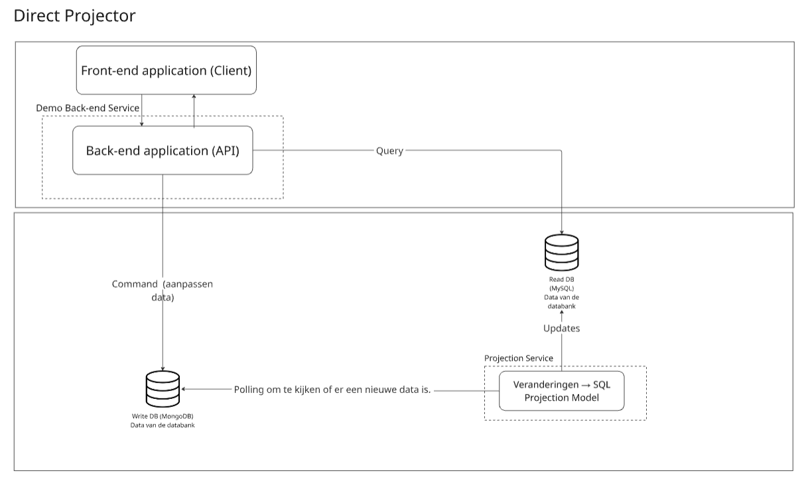
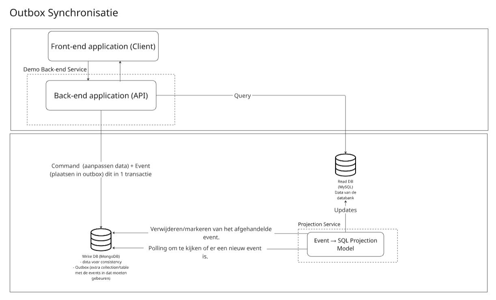
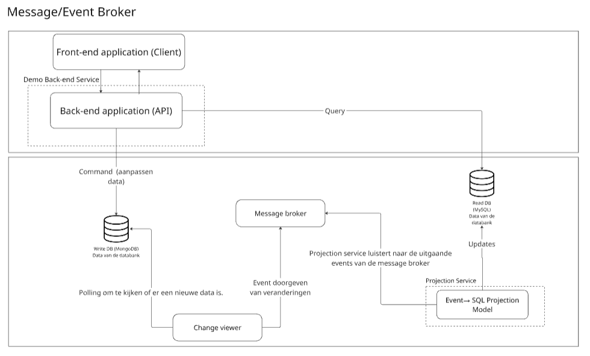
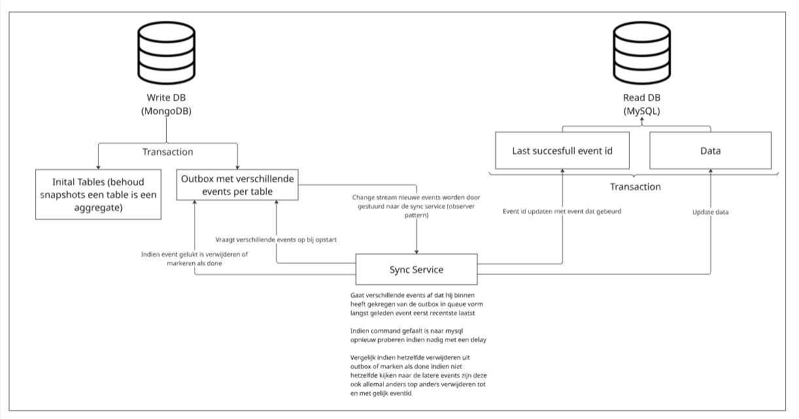

# Research flow

## Define your research objective

- Wat probleem lossen we op?
  - Synchronisatie tussen 2 databanken zonder dat er data verlies optreed voor CQRS doeleinden.
- Wie zijn de gebruikers?
  - Developers dat gebruik willen maken van CQRS (Command Query Responsibility Segregation)
- Hoe weten we of het werkt?
  - Indien we een write doen naar de command databank en deze veranderingen zichtbaar worden in de query databank.
- Wat is in de scope wat is er buiten
  - Binnen
    - Synchronisatie
      - Geen dataverlies
      - Mogelijkheid tot herstel
      - Geen data inconsistentie
    - Ervoor zorgen dat de databanken loosly coupled zijn
    - Event sourcing (op later moment)
  - Buiten
    - Meerdere query/command databanken
    - Zeer complexe commands
    - andere

## Identify stakeholders and use cases

De stakeholders zullen vooral developers zijn alsook de product owner.

De belangrijkste use case is "Als een developer wil ik databanken gemakkelijk kunnen syncroniseren zodat ik een aparte query en command databank kan hebben".

Andere use cases:

Developer: 

- Als een developer wil ik een performant product afleveren zodat de gebruikers geen hinder ondervinden van wat er allemaal gebeurd achter hun rug.
- Als een developer wil ik databanken kunnen synchroniseren zonder problemen zodat ik zonder problemen CQRS kan toepassen over 2 databanken.
- Als een developer wil ik databanken gemakkelijk terug synchronseren indien er een inconsistentie is zodat de databanken gelijk lopen wat betreft data.
- Als een developer wil ik dat indien er bepaalde commands onbedoeld dubbel worden uitgezonden deze niet dubbel worden uitgevoerd (idempotent) zodat mijn data niet inconsistent wordt.
- Als een developer wil ik dat indien de command databank onbereikbaar is ik nog steeds informatie kan opvragen zodat het opvragen van gegevens geen impact ondervind.
- Als een developer wil ik dat indien er een onderdeel van de synchronisatie faalt er geen data verlies optreed zodat ik er zeker van kan zijn dat mijn data tussen de 2 databanken gelijk is.
- Als een developer wil ik dat het verkeer van queries & commands verdeeld is over de databanken zodat er bij veel verkeer geen impact is.
- Als een developer wil ik gemakkelijk een container opbouwen van het CQRS systeem zodat deze gemakkelijk te integreren valt.
- Als een developer wil ik een demo applicatie dat de synchronisatie flow aantoont zodat ik er zeker van ben dat het CQRS systeem werkt.
- Als een developer wil ik dat events die niet verwerkt kunnen worden, apart worden gezet (Dead Letter Queue) zodat ik deze kan analyseren en later opnieuw kan 'replayen' zonder de rest van de queue te blokkeren zodat de events verder kunnen gaan zonder problemen. (Could Have)

Product owner:

- Als de product owner wil ik dat mijn product met zo weinig mogelijk down-time kan werken zodat ik geen klanten verlies omdat mijn product weeral offline is.
- Als de product owner wil ik dat mijn product niet volledig kapot gaat indien er een databank niet meer werkt zodat er steeds een deel werkend zal zijn.

## Master core concepts

### CQRS concept

CQRS ook gekend als Command Query Responsibility Segregation is op het hoogste niveau niet meer dan het opsplitsen van hoe je commands (acties) en queries (opvragen van gegevens) uitvoert op een databanken. Deze opsplitsing gebeurd al op een architetureel niveau waardoor je een aparte service zal hebben voor de queries & commands.

In dit project word er nog een stap verder gegaan en is de databank waar de commands op worden uitgevoerd een andere databank dan deze waar er word van gelezen.

- https://www.geeksforgeeks.org/system-design/cqrs-command-query-responsibility-segregation/
- https://cqrs.wordpress.com/about/
- https://www.arnaudlanglade.com/difference-between-cqs-and-cqrs-patterns/

### CQRS Synchronisatie

Zoals zonet vermeld kan je dus gaan voor aparte databanken voor CQRS. De moeilijkheid hieraan is hoe ga je ervoor zorgen dat de gegevens tussen de twee databanken hetzelfde is. Hiervoor zijn er verschillende opties zoals in dit research document te zien is.

- https://eventuate.io/docs/manual/eventuate-tram/latest/distributed-data-management.html
- https://blog.bytedoodle.com/cqrs-schema-design-synchronization-and-consistency-considerations/
- https://medium.com/@dinesharney/understanding-cqrs-patterns-implementation-strategies-and-data-synchronization-9f35acdf0e71 

### Projector

Een projector zet het evenement of de verandering in data om naar een correct command, zodat de query databank correct kan worden geüpdatet

- https://event-driven.io/en/projections_and_read_models_in_event_driven_architecture/

### Command databank

Op de command databank worden enkel de commands van de gebruiker uitgevoerd. Dit wilt zeggen dat indien de gebruiker informatie wilt aanpassen deze databank zal worden gebruikt.

- https://www.sciencedirect.com/topics/computer-science/database-command 

### Query databank

De query databank word enkel gebruikt om queries uit te voeren dit wilt dus zeggen dat indien de gebruiker informatie wilt opvragen deze databank zal worden gebruikt.

- https://www.techtarget.com/searchdatamanagement/definition/query 

### Event Sourcing

Dit is het principe van het opslaan van verschillende events en deze events toe te passen op data. Het is dan mogelijk om naar een vorige staat van de data terug te keren door de events terug af te spelen vanaf de start staat. Of door het omgekeerde van de events uit te voeren dit hangt af van de implementatie. Event sourcing zorgt voor een duidelijk overzicht van welke acties allemaal ondernomen zijn op de data waardoor de momentele staat bereikt is.

- https://medium.com/@alxkm/event-sourcing-explained-benefits-challenges-and-use-cases-d889dc96fc18 
- https://microservices.io/patterns/data/event-sourcing.html
- https://learn.microsoft.com/en-us/azure/architecture/patterns/event-sourcing 

## Compare existing solutions

### Debezium (https://debezium.io/)

Deze oplossing kijkt naar veranderingen in de command databank met behulp van polling eenmaal een verandering word opgemerkt en vertaalt naar events. Vervolgens worden deze events op een message broker (kafka) gepusht. Waar dan naar geluisterd kan worden door verschillende processen deze zullen dit event dan ontvangen. Onder deze processen zal dan een process zijn dat de ontvangen messages omzet naar de juiste commands en deze uitvoeren op de query databank.

### Axon Framework door Axoniq (https://www.axoniq.io/framework)

Deze oplossing is meer Event Sourcing specifiek en zal dus evenementen opslaan in een databank ook gekend als de event store. Er is ook een Tracking Event Processor dat door polling op de hoogte word gebracht van nieuwe events. De Tracking Event Processor houd bij welk event het laatst afgehandeld is. Dit is op basis van de Tracking Token deze geeft weer op welke positie het event is in de event store. De Tracking Event Processor kan dan gewoon kijken naar het volgende Tracking Token voor het volgende event.

De query databank word aangepast door met projections van de events naar een correct commando. Eenmaal dit gelukt is word de Tracking Token geupdate naar de Tracking Token van het zojuiste geslaagde event.

### Revo Framework (https://docs.revoframework.net/)

De verschillende events worden in deze oplossing ook opgeslagen in een Event Store en op een event bus gezet. De nieuwe events komen via de event bus in een async event queue terecht waarna eventlisteners de projectors op de hoogte brengen. Deze projectors zetten de events dan opnieuw om naar commands voor de query databank. Door de event store kan gemiste events worden afgehandeld bij heropstart.

## Define requirements

Functionele requirements:

- Gegarandeerd idempotente updates (geen duplicate events)
- Heropstart/replay mechanisme om mogelijke inconsitenties op te vangen
- Write & read operaties maken gebruik van andere databank en zijn loosly-coupled (niet van elkaar afhankelijk)
- Demo applicatie voor de synchronisatie flow te demonstreren in een echte app.
- Een docker container voor de syncronisatie flow & demo applicatie

Niet functionele requirements:

- Betrouwbaar -> geen data verlies, ...
- Performantie -> synchronisatie binnen enkele seconden
- Testbaarheid -> meer dan 80% test coverage
- Observeerbaar -> logs & metrics van de status
- Reproduceerbaar
- Documentatie, keuzes en gebruik van bepaalde mogelijkheden
- Gebruik van DDD-model
- Gemakkelijk te gebruiken
- Gebruik van best practices

### Acceptance checkpoint

De MVP is een demo applicatie dat gebruik maakt van CQRS met onze synchronisatie implementatie tussen een mongoDb (command databank) en mysql (query databank) dit met een hoge betrouwbaarheid en snelheid dit voor simpele INSERT, UPDATE, DELETE commands.

De CQRS implementatie moet voldoen aan volgende pipeline onderdelen:
- 80% test coverage
- kwaliteit code linted 
- testen moeten volledig slagen

## Technologie & Architectuur Opties

### Programmeertalen
| Onderwerp                                  | C#                                               | Java                             | TypeScript                     | Systeemtalen                       |
|--------------------------------------------|--------------------------------------------------|----------------------------------|--------------------------------|------------------------------------|
| Performantie                               | Goed                                             | Goed                             | Minder                         | Zeer goed                          |
| Typering                                   | Sterke typering                                  | Sterke typering                  | Losse typering tijdens runtime | (Vaak) sterke typering             |
| Documentatie                               | Goed                                             | Minder                           | Goed                           | Wisselend                          |
| Complexiteit                               | Gemiddeld                                        | Gemiddeld                        | Laag                           | Hoog                               |
| Syntax mogelijkheden                       | Meerdere manieren om hetzelfde te bereiken       | Eén manier per functionaliteit   | Flexibel                       | Strikt                             |
| Ingebouwde functionaliteit & Uitbreidingen | Veel                                             | Veel                             | Minder                         | Beperkt, maar uitbreidbaar         |
| Extra                                      | Uitgebreid .NET-ecosysteem                       | Platformonafhankelijk (JVM)      | JavaScript met types           | Handmatig memory management        |

#### Conclusie
We hebben onze keuze gemaakt op basis van de typering, documentatie en complexiteit tegenover performantie.

Een sterke typering is het meest gewenst voor onze use case dit omdat je verschillende events zal binnen krijgen en er zal moeten bepaald worden wat hier in zit. Indien hier iets fout in gebeurd willen we hier het liefst een error van krijgen en niet dat het programma verder gaat zonder problemen.

De documentatie moet gemakkelijk te navigeren zijn en duidelijk uit leggen wat bepaalde methodes doen. 

De complexiteit tegenover performantie we willen niet te complex gaan waardoor we plots zeer veel zelf zullen moeten doen maar de performantie moet nog steeds goed blijven.

We hebben rekening gehouden met deze punten en daarom hebben we uiteindelijk gekozen voor C#. Deze taal heeft een goede documentatie, een sterke typering en de complexiteit tegenover performantie is zeer goed.

### CDC mogelijkheden

Ook gekend als Change Data Capture dit is een design pattern dat gebruikt word om veranderingen waar te nemen in een databank. Er zijn verschillende mogelijkheden hieronder enkele opties.

#### Log-based

Deze methode zal de veranderingen waarnemen door steeds naar de transactie logs te vragen. En hier dus veranderingen in zal waarnemen.

#### Trigger-based

Deze optie maakt gebruik van databank triggers om veranderingen te zien. Indien er iets veranderd in de databank zal dan een stukje code worden getriggerd en veranderingen aangeven.

#### Query-based

Deze methode zal de databank regelmatig aanvragen en kijken of de current state gelijk is met de vorige state dat het heeft binnen gevraagd. De verschillende veranderingen worden dan gezien.

#### Change Stream

Deze optie is ingebouwd in MongoDB en is dus mongoDB specifiek. MongoDB zal steeds naar iedereen dat het horen wilt sturen wat er veranderd is aan de databank. Hier kan dan op worden gesubscribed.

#### Conclusie 
|               | Schaalbaarheid | Impact    | Latentie  | Volledigheid |
| ------------- | -------------- | --------- | --------- | ------------ |
| Log-based     | Zeer goed      | Zeer laag | Laag      | Volledig     |
| Trigger-based | Laag           | Hoog      | Gemiddeld | Volledig     |
| Query-based   | Minder goed    | Gemiddeld | Hoog      | Laag         |
| Change stream | Zeer goed      | Zeer laag | Zeer laag | Volledig     |

Er is gekozen voor de change stream optie voor de vollegende reden. Change stream heeft bijna dezelfde voordelen als log-based maar scoort beter op latentie dit komt doordat er niet moet worden gepolled (constant vragen of er iets nieuw is). Verder zal er gedurende het project gewerkt worden met mongoDb zoals beschreven in de projectbeschrijving. Indien we toch een andere command databank zouden willen gebruiken is de overstap niet groot naar een andere CDC optie. Het enige wat de CDC uiteindelijk moet doen is aangeven wat er veranderd is in de databank.

### CQRS Synchronisatie mogelijkheden

#### Direct projection

Een direct projection controleert de write database continu op veranderingen in de data. Zodra een verandering wordt waargenomen, projecteert de projector deze direct naar de read database, die vervolgens wordt bijgewerkt.

Een direct projection is echter geen optimale oplossing: het biedt geen mogelijkheid om data later te herstellen en het wordt moeilijk om gemiste veranderingen alsnog te verwerken. Bovendien kunnen veranderingen niet meer worden gedetecteerd zodra ze zijn gepasseerd.



#### Outbox

Deze architectuur slaat de verschillende events op in een table/collectie in de databank. Vervolgens kan dan gekeken worden naar de outbox voor de verschillende evenementen. Wanneer er een verandering optreedt, wordt deze doorgegeven aan een projector, die de aanpassing toepast op de query databank.

Recovery is mogelijk door het laatste geslaagde event bij te houden. Op basis van dit event kan je bepalen wat het volgende event is dat aanwezig is in de outbox. 

Verder is dit atomisch door dat er gebruik word gemaakt van de databank transacties. En omdat de projection kan zeggen tegen de outbox dat een event gelukt is of niet. Dit zorgt ervoor dat er geen Dual-write problem is.



#### Message/Event Broker

Deze oplossing maakt gebruik van een message broker en polling. Je kan een message broker zo worden geconfigureerd dat deze de verschillende events persistent bijhoudt, wat dus wilt zeggen dat de events niet verloren zal gaan indien de message broker uitvalt. Er is eigenlijk geen gemakkelijke manier om het dual-write problem op te lossen. Tenzij je gebruik zou maken van een outbox hiervoor.



#### Conclusie

|                            | Dual-write problem                               | Schaalbaarheid | Recovery | Event Sourcing later | Snelheid  | Complexiteit |
| -------------------------- | ------------------------------------ | -------------- | -------- | -------------------- | --------- | ------------ |
| **Direct Projector** | Aanwezig                                 | Niet           | Niet     | Slecht               | Normaal   | Zeer simpel  |
| **Outbox**           | Opgelost                            | Goed           | Goed     | Goed                 | Goed      | Complex      |
| **Message Broker**   | Mogelijkheid tot (meer complexiteit) | Zeer goed      | Goed     | Goed                 | Zeer goed | Zeer complex |

De direct projector is geen goede optie aangezien het bij een mogelijk falen van de databank niet zal kunnen recoveren.

De message broker is de meest schaalbare optie maar is zeer complex om te implementeren, verder kan je niet zonder extra complexiteit garanderen dat een event uitgevoert is op de query databank.

De outbox is stabiel en betrouwbaar en is ook de enige manier die zonder veel moeite kan garanderen of een event wel uitgevoerd is of niet.

### Uitkomst

Uiteindelijk is er gekozen voor de volgende technologieën & architectuur opties. C# als programmeertaal, Change Stream als CDC (data veranderingen waarnemen) en voor outbox om de CQRS synchronisatie te regelen. Dit met enkele veranderingen om exactly-once processing te verkrijgen.

Wat het volgende schema maakt:


## Run small Proofs of Concept (PoCs)

### Change Stream met MongoDB in Dotnet
Dit codevoorbeeld toont hoe je subscribed op een change stream in dotnet. Als je kan zien is dit redelijk simpel. Je maakt een cursor object aan via de `Watch()` methode (`WatchAsync()` voor async applicaties). De informatie voor dit codevoorbeeld is verkregen via de [MongoDB docs](https://www.mongodb.com/docs/drivers/csharp/current/logging-and-monitoring/change-streams/)

[Volledige code change stream](https://github.com/LanderDebeir/ChangestreamTryout)

```csharp
var client = new MongoClient("mongodb://localhost:27017");
var database = client.GetDatabase("TestDatabase");
var collection = database.GetCollection<BsonDocument>("TestCollection");

var pipeline = new EmptyPipelineDefinition<ChangeStreamDocument<BsonDocument>>()
    .Match("{operationType: { $in: ['insert', 'delete', 'update'] }}");
var options = new ChangeStreamOptions
{
    FullDocument = ChangeStreamFullDocumentOption.UpdateLookup
};

using var cursor = await collection.WatchAsync(pipeline, options);
Console.WriteLine("Watching for changes...");

_ = Task.Run(async () =>
{
    await Task.Delay(1000);
    await collection.InsertOneAsync(new BsonDocument("Name", "Jack"));
});

foreach (var change in cursor.ToEnumerable())
{
    Console.WriteLine($"Change detected: {change.OperationType}");
    switch (change.OperationType)
    {
        case ChangeStreamOperationType.Insert:
            Console.WriteLine("Action: INSERT");
            Console.WriteLine($"Data: {change.FullDocument}");
            break;
        case ChangeStreamOperationType.Update:
            Console.WriteLine("Action: UPDATE");
            Console.WriteLine($"Changes: {change.UpdateDescription.UpdatedFields}");
            break;
        case ChangeStreamOperationType.Delete:
            Console.WriteLine("Action: DELETE");
            Console.WriteLine($"Deleted ID: {change.DocumentKey}");
            break;
    }
}

```

De change stream geeft volgende events weer bij het gebruik van BackingDocuments indien er een aanpassing is

```js
{ "_id" : { "_data" : "..." }, "operationType" : "update", "clusterTime" : Timestamp(...),
"wallTime" : ISODate("..."), "ns" : { "db" : "sample_restaurants", "coll" : "restaurants" },
"documentKey" : { "_id" : ObjectId("...") }, "updateDescription" : { "updatedFields" : { "cuisine" : "Irish" },
"removedFields" : [], "truncatedArrays" : [] } }
```

De change stream stelt het ook mogelijk om het volledige aangepaste veld te zien bij een aanpassing met FullDocument

```js
{ "_id" : { "$oid" : "69285ec4b7355988a3e5083a" }, "address" : { "building" : "1007", "coord" : [-73.856076999999999, 40.848447], "street" : "Morris Park Ave", "zipcode" : "55555" }, "borough" : "Bronx", "cuisine" : "Bakery", "grades" : [{ "date" : { "$date" : "2014-03-03T00:00:00Z" }, "grade" : "A", "score" : 2 }, { "date" : { "$date" : "2013-09-11T00:00:00Z" }, "grade" : "A", "score" : 6 }, { "date" : { "$date" : "2013-01-24T00:00:00Z" }, "grade" : "A", "score" : 10 }, { "date" : { "$date" : "2011-11-23T00:00:00Z" }, "grade" : "A", "score" : 9 }, { "date" : { "$date" : "2011-03-10T00:00:00Z" }, "grade" : "B", "score" : 14 }], "name" : "Morris Park Bake Shop", "restaurant_id" : "30075445" }
```

#### Nu rest de vraag natuurlijk werkt dit ook in een container?

Dit werkt ook in een container. In deze POC is er gekozen voor Docker, de aanpassingen om dit te laten werken voor een container zijn:

Het aangeven aan de container dat het zal gebruikt worden als een replica-set [Replica set documentation](https://www.mongodb.com/docs/manual/reference/method/rs.initiate/) voor de rest zal de code er hetzelfde uitzien als in bovenstaande voorbeeld.

[Volledige code change stream in container](https://github.com/Or3nges/POC-mongoDB-change-streams-in-docker)

```js
function initiateReplicaSet() {
  try {
    const status = rs.status();
    if (status.ok === 1) {
      print("Replica set already initialized.");
      return;
    }
  } catch (e) {
    print("Replica set not initialized, proceeding...");
  }

  rs.initiate({
    _id: "rs0",
    members: [{ _id: 0, host: "mongo-db:27017" }]
  });

  print("Replica set initiated.");
}

let retries = 10;
while (retries > 0) {
  try {
    initiateReplicaSet();
    break;
  } catch (err) {
    print("MongoDB not ready yet, retrying in 2s...");
    sleep(2000);
    retries--;
  }
}

if (retries === 0) {
  print("Failed to initiate replica set after multiple attempts.");
}
```

## Publicatie & Open Source Strategy

### Repo setup

De volgende repo's zullen aanwezig zijn. group-05-CQRS-synchronization & group-05-CQRS-demo-applicatie (effectieve naam demo ligt nog niet vast). In de synchronization repo zal de implementatie van het CQRS systeem worden gemaakt terwijl de demo repo het CQRS systeem zal implementeren om te kunnen demonstreren dat de flow/CQRS implementatie werkt. Elke repo zal een README.md bevatten met een verdere uitleg over de repo. Hoe deze te gebruiken valt, extra uitleg, bugs en dergelijke.

### Licentie

We hebben gekozen voor een MIT-License voor maximale vrijheid en eenvoud. MIT is permissief en staat non-commercieel en commercieel (en zelf closed source) gebruik toe zonder enige complexe patentclausules. Hierdoor zal de software zeer toegangkelijk zijn om te gebruiken door verschillende developers.

https://choosealicense.com/licenses/

### CI/CD basics (test coverage, pipeline, main niet pushen (repo rules), ...)
#### Reporegels
Het zal niet mogelijk zijn om naar main te pushen. Elke verandering moet dus verlopen via een branch dat vervolgens gemerged kan worden indien 2 teamleden de code hebben nagekeken en geapproved hebben.

#### Pipeline
Verder zal de pipeline er als volgt uit zien:
- meer dan 80% testcoverage 
- code linted zonder problemen
- maken van container 

#### Release strategy
Er is gekozen voor het gebruik van containers omdat containers ervoor zorgen dat de cqrs implementatie op verschillende platformen kan worden opgezet en gebruikt. Ook zorgen containers ervoor dat de implementatie gemakkelijk kan verdeeld worden en dat we er zeker van zijn dat als onze container werkt dit ook het geval zal zijn bij de andere containers. Verder is het ook aangegeven in de opdracht dat er gebruik moet worden gemaakt van containers.

##### Release checklist
- [ ] CQRS implementatie dat gemakkelijk te configureren valt
- [ ] Demo applicatie dat de CQRS implementatie gebruikt en aangeeft dat het werkt alsook hoe het kan worden gebruikt.
- [ ] Slagen van de verschillende pipelines

## Plan & Milestones 

| # | Milestone                   | Duratie       | Beschrijving                                                                                                                                  |
| - |-----------------------------|---------------|-----------------------------------------------------------------------------------------------------------------------------------------------|
| 1 | Onderzoek                   | 24/11 - 30/11 | Probleemanalyse, technologievergelijking, requirements definiëren en architectuur vastleggen.                                                 |
| 2 | Op start Core implementatie | 01/12 - 07/12 | Opzetten development omgeving (projectstructuur, CI/CD pipelines, ...) en start implementatie.                                                |
| 3 | Core Implentatie            | 08/12 - 21/12 | Verder bouwen van de Sync Service, Outbox implementatie en de koppeling tussen MongoDB en MySQL alsook de demo applicatie voor de flow (MVP). |
| 4 | Code Finalisatie            | 22/12 - 09/01 | Verder uitwerken, extra features, bugfixing, refactoring van CQRS implementatie & demo applicatie.                                            |
| 5 | Thesis Finalisatie          | 10/01 - 18/01 | Afronden van de scriptie, documentatie en formuleren van conclusies.                                                                          |

In parallel met deze milestones zal er natuurlijk ook gewerkt worden aan de bachelorproef.

## Alternatives considered
- Java -> documentatie van C# is iets beter
- TypeScript -> lose typing tijdens runtime
- Systeemtalen -> zeer complex

- message broker -> meer complexiteit
- direct projection -> geen recovery mechanisme

- query-based CDC -> een hoge latentie 
- log-based CDC -> change stream was net iets beter doordat er mongodb word gebruikt
- trigger-based CDC -> te hoge impact om de databank

## Bronnen
CQRS:
- https://cqrs.wordpress.com/about/ (als je binnen deze site wilt navigeren zal u het domein moeten veranderen naar cqrs.wordpress.com)
- https://awesome-architecture.com/cqrs/
- https://medium.com/@90mandalchandan/cqrs-architecture-how-it-works-5f18a36886ea 
- https://www.linkedin.com/pulse/how-do-you-build-fast-lightweight-solution-cqrs-event-daniel-miller-ymjqc/
- https://github.com/leandrocp/awesome-cqrs-event-sourcing 
- https://www.arnaudlanglade.com/difference-between-cqs-and-cqrs-patterns/ 
- https://www.cncf.io/blog/2020/08/13/49940/
- https://eventuate.io/docs/manual/eventuate-tram/latest/distributed-data-management.html

CQRS synhronisatie: 
- https://ricofritzsche.me/cqrs-event-sourcing-projections/ 
- https://en.wikipedia.org/wiki/Change_data_capture
- https://www.mongodb.com/docs/manual/changestreams/
- https://microservices.io/patterns/data/transactional-outbox.html
- https://www.bennyjohns.com/posts/20201115-commands-and-queries-with-a-message-broker
- https://medium.com/@nemagan/handling-data-consistency-in-kafka-techniques-for-exactly-once-processing-40f41b1a0364
- https://microservices.io/patterns/data/transactional-outbox.html

CQRS implementaties:
- Kim van Renterghem (C#): https://github.com/kimVanRenterghemNew/EventSourcingAndCQRS 
- Gregor Young(C#): https://github.com/gregoryyoung/m-r
- Carl Hoberg(Ruby): https://github.com/cavalle/banksimplistic
- Mark Nijhof (C#) https://github.com/MarkNijhof/Fohjin
- (Java) https://github.com/ddd-by-examples/event-source-cqrs-sample/tree/master

Event Sourcing:
- https://awesome-architecture.com/event-sourcing/
- https://www.kurrent.io/webinar-recording-introduction-to-event-sourcing?utm_campaign=Webinar%20-%20Introduction%20to%20Event%20Sourcing&utm_medium=email&_hsmi=348022371&utm_content=348022371&utm_source=hs_automation
- https://microservices.io/patterns/data/event-sourcing.html 
- https://www.baeldung.com/cqrs-event-sourcing-java
- https://www.kurrent.io/event-sourcing
- https://www.kurrent.io/blog/why-event-sourcing/
- https://dev.to/lukasniessen/event-sourcing-cqrs-and-micro-services-real-fintech-example-from-my-consulting-career-1j9b
- https://craigjcox.com/guides/event-sourcing

CDC (Change Data Capture)
- https://en.wikipedia.org/wiki/Change_data_capture
- https://medium.com/@marekchodak/change-data-capture-with-mongodb-change-streams-539a02cf401d
- https://debezium.io/blog/2020/02/10/event-sourcing-vs-cdc/
- https://amsayed.medium.com/the-various-methods-of-change-data-capture-cdc-with-examples-and-code-snippets-e5d6ea14dc88
- https://www.reddit.com/r/dataengineering/comments/moopot/can_someone_help_me_understand_the_difference/
- https://solace.com/blog/cdc-solace-cqrs-enabled-application/
- https://satyadeepmaheshwari.medium.com/understanding-cqrs-and-cdc-a-practical-guide-with-real-world-analogies-f0fce76fc2e6

Debezium:
- https://debezium.io/documentation/faq/  
- https://debezium.io/documentation/reference/stable/architecture.html 
- https://debezium.io/documentation/reference/stable/connectors/mongodb-sink.html 
- https://debezium.io/documentation/reference/stable/connectors/jdbc.html 

Axon Framework:
- https://docs.axoniq.io/axon-framework-reference/4.11/ 
- https://www.baeldung.com/axon-cqrs-event-sourcing  
- https://medium.com/fively/axon-framework-explaining-the-power-of-event-driven-architecture-208b30f5f737 
- https://medium.com/axoniq/demystifying-tracking-event-processors-in-axon-framework-1917c2f16e59 
- https://javadoc.io/doc/org.axonframework/axon-core/3.3.6/org/axonframework/eventhandling/TrackingEventProcessor.html 

