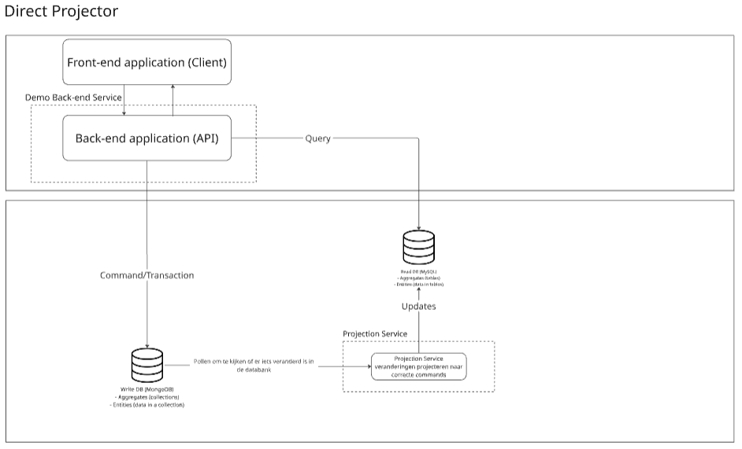

# Research flow
## Define your research objective


- Wat probleem lossen we op?
  - Synchronisatie tussen 2 databanken zonder dat er data verlies optreed voor CQRS doeleinden.
- Wie zijn de gebruikers?
  - Developers dat gebruik willen maken van CQRS (Command Query Responsibility Segregation)
- Hoe weten we of het werkt?
  - Indien we een write doen naar de write databank en deze veranderingen zichtbaar worden in de read databank.
- Wat is in de scope wat is er buiten
  - Synchronisatie
    - Idempotent (geen dubbele events)
    - Geen dataverlies
    - Mogelijkheid tot herstel
  - Ervoor zorgen dat de databanken loosly coupled zijn
  - Event sourcing (op later moment)

## Identify stakeholders and use cases
De stakeholders zullen vooral developers zijn alsook de product owner.

Developer: (duplicate info, data verlies, ...)
- Als een developer wil ik een performant product afleveren zodat de gebruikers geen hinder ondervinden van wat er allemaal gebeurd achter hun rug.
- Als een developer wil ik databanken kunnen synchroniseren zonder problemen zodat ik zonder problemen CQRS kan toepassen over 2 databanken.
- Als een developer wil ik databanken gemakkelijk terug synchronseren indien er een inconsistentie is zodat de databanken gelijk lopen wat betreft data.
- Als een developer wil ik dat indien er bepaalde commands onbedoeld dubbel worden uitgezonden deze niet dubbel worden uitgevoerd (idempotent) zodat mijn data niet inconsistent wordt.
- Als een developer wil ik dat indien de write databank onbereikbaar is ik nog steeds informatie kan opvragen zodat het opvragen van gegevens geen impact ondervind.
- Als een developer wil ik dat indien er een onderdeel van de synchronisatie faalt er geen data verlies optreed zodat ik er zeker van kan zijn dat mijn data tussen de 2 databanken gelijk is.
- Als een developer wil ik dat het verkeer van queries & commands verdeeld is over de databanken zodat er bij veel verkeer geen impact is.
- Als een developer wil ik gemakkelijk een container opbouwen van het CQRS systeem zodat deze gemakkelijk te integreren valt.
- Als een developer wil ik een demo applicatie dat de synchronisatie flow aantoont zodat ik er zeker van ben dat het CQRS systeem werkt.
- Als een developer wil ik dat events die niet verwerkt kunnen worden, apart worden gezet (Dead Letter Queue) zodat ik deze kan analyseren en later opnieuw kan 'replayen' zonder de rest van de queue te blokkeren zodat de events verder kunnen gaan zonder problemen. (Could Have)
- ...

Product owner:
- Als de product owner wil ik dat mijn product met zo weinig mogelijk down-time kan werken zodat ik geen klanten verlies omdat mijn product weeral offline is.
- Als de product owner wil ik dat mijn product niet volledig kapot draait indien er een databank niet meer werkt zodat er steeds een deel werkend zal zijn.
- ...

## Master core concepts
### CQRS concept
CQRS ook gekend als Command Query Responsibility Segregation is op het hoogste niveau niet meer dan het opsplitsen van hoe je commands (acties) en queries (opvragen van gegevens) uitvoert op een databanken. Deze opsplitsing gebeurd al op een architetureel niveau waardoor je een aparte service zal hebben voor de queries & commands.

In dit project word er nog een stap verder gegaan en is de databank waar de commands op worden uitgevoerd een andere databank dan deze waar er word van gelezen. 

### CQRS Synchronisatie
Zoals zonet vermeld kan je dus gaan voor aparte databanken voor CQRS. De moeilijkheid hieraan is hoe ga je ervoor zorgen dat de gegevens tussen de twee databanken hetzelfde is. Hiervoor zijn er verschillende opties zoals hieronder te zien is.

### Projector
Een projector zet het evenement of de verandering in data om naar een correct command, zodat de read databank correct kan worden geüpdatet

### Write databank
Op de write databank worden enkel de commands van de gebruiker uitgevoerd. Dit wilt zeggen dat indien de gebruiker informatie wilt aanpassen deze databank zal worden gebruikt.

### Read databank
De read databank word enkel gebruikt om queries uit te voeren dit wilt dus zeggen dat indien de gebruiker informatie wilt opvragen deze databank zal worden gebruikt.

### Event Sourcing
Dit is het principe van het opslaan van verschillende events en deze events toe te passen op data. Het is dan mogelijk om naar een vorige staat van de data terug te keren door de events terug af te spelen vanaf de start staat. Of door het omgekeerde van de events uit te voeren dit hangt af van de implementatie. Event sourcing zorgt voor een duidelijk overzicht van welke acties allemaal ondernomen zijn op de data waardoor de momentele staat bereikt is. 

## Compare existing solutions
### Debezium (https://debezium.io/)
Deze oplossing kijkt naar veranderingen in de write databank met behulp van polling eenmaal een verandering word opgemerkt en vertaalt naar events. Vervolgens worden deze events op een message broker (kafka) gepusht. Waar dan naar geluisterd kan worden door verschillende processen deze zullen dit event dan ontvangen. Onder deze processen zal dan een process zijn dat de ontvangen messages omzet naar de juiste commands en deze uitvoeren op de read databank.

### Axon Framework door Axoniq (https://www.axoniq.io/framework)
Deze oplossing is meer Event Sourcing specifiek en zal dus evenementen opslaan in een databank ook gekend als de event store. Er is ook een Tracking Event Processor dat door polling op de hoogte word gebracht van nieuwe events. De Tracking Event Processor houd bij welk event het laatst afgehandeld is. Dit is op basis van de Tracking Token deze geeft weer op welke positie het event is in de event store. De Tracking Event Processor kan dan gewoon kijken naar het volgende Tracking Token voor het volgende event. 

De read databank word aangepast door met projections van de events naar een correct commando voor de write databank. Eenmaal dit gelukt is word de Tracking Token geupdate naar de Tracking Token van het zojuiste geslaagde event.

Deze oplossing zal ook kijken naar veranderingen in de write databank maar de write databank zal events bevatten (Event Sourcing)

### Nog een bestaande oplossing
- debezium (CDC)
- axoniq (event sourcing) (axon framework)
- Django CQRS Library (python CQRS)
- andere opties met meer documentatie dan django???

## Define requirements
### Doen we project + ons maar meer gefiltert of enkel ons
Functionele requirements:
- Gegarandeerd idempotente updates (geen duplicate events)
- Heropstart/replay mechanisme om mogelijke inconsitenties op te vangen
- Write & read operaties maken gebruik van andere databank en zijn loosly-coupled (niet van elkaar afhankelijk)
- Demo applicatie voor de synchronisatie flow te demonstreren in een echte app.
- Een docker container voor de syncronisatie flow & demo applicatie

Niet functionele requirements:
- Betrouwbaar -> geen data verlies bij heropstarts, ...
- Performantie -> synchronisatie binnen enkele seconden
- Testbaarheid -> meer dan 80% test coverage
- Observeerbaar -> logs & metrics van de status
- Reproduceerbaar
- Documentatie, keuzes en gebruik van bepaalde mogelijkheden

### Volgens project
Must haves volgens project
- Implement a domain model with entities (DDD-inspired) for the write side.
- Detect changes in MongoDB.
- Update MySQL projections using one of the chosen approaches.
- Guarantee idempotent updates (no duplicates).
- Provide recovery/replay so the system can catch up after restarts.
- Deliver a demo app that shows synchronization flow.
- Supply a Docker Compose setup (MongoDB, MySQL, and optional broker).
- Document your setup, design choices, and usage.

Non functional volgens project
- Reliability: no data loss on restart; consistent updates.
- Performance: synchronization within a few seconds.
- Testability: ≥ 80% test coverage.
- Observability: logs and metrics that show system state.
- Reproducibility: one-command setup (Docker Compose).
- Documentation: README and demo examples

### Acceptance checkpoint (IS DIT WELL CORRECT NAKIJKEN)
De MVP is een demo applicatie dat gebruik maakt van CQRS met onze synchronisatie implementatie tussen een mysql (write databank) en mysql (read databank) dit met een hoge betrouwbaarheid en snelheid. 

## Evaluatie Tech-stack
- Programmeertalen en frameworks
  - TypeScript
  - Java
  - **.NET (ASP.NET, MediatR, EFCore)**
  - Go
  - Systeemtalen (C / C++ / Rust)
- Architectuur 
  - **Direct Projection**
  - **Change Stream (MongoDB specifiek)**
  - CDC (Change Data Capture)
  - **Outbox**
  - Message / Event Broker

| Technologie                  | Type        | Voordelen                                                                                                                     | Nadelen                                                                                                 | Conclusie                                                                                                                 |
|:-----------------------------|:------------|:------------------------------------------------------------------------------------------------------------------------------|:--------------------------------------------------------------------------------------------------------|:--------------------------------------------------------------------------------------------------------------------------|
| **.NET (C#) / ASP.NET**      | Managed     | **Sterke Type-veiligheid** (ook runtime), volwassen ecosysteem (MediatR, EF Core), snelle development door krachtige tooling. | Iets zwaarder dan Go of Node.js, maar verwaarloosbaar voor deze use-case.                               | **Gekozen.** Biedt de beste balans tussen veiligheid, snelheid van ontwikkelen en robuuste frameworks voor CQRS.          |
| **Java**                     | Managed     | Vergelijkbaar met C# qua robuustheid en type-veiligheid.                                                                      | Vaak meer boilerplate code nodig; team expertise ligt sterker bij C#.                                   | **Afgevallen.** Technisch capabel, maar minder efficiënt gezien de huidige stack-voorkeur.                                |
| **TypeScript (Node/Deno)**   | Interpreted | Snel op te zetten, JSON-native (handig voor MongoDB).                                                                         | **Weak typing bij runtime**: data-integriteit is lastig te garanderen. Minder volwassen CQRS-tooling.   | **Afgevallen.** Risico op data-inconsistentie door gebrek aan strikte runtime types is te groot voor een sync-applicatie. |
| **Go (Golang)**              | Compiled    | Zeer hoge performance, simpele concurrency.                                                                                   | Minder krachtige ORM's/Frameworks vergeleken met EF Core. Verbose error handling vertraagt development. | **Afgevallen.** Performance winst weegt niet op tegen het gemis aan enterprise features (zoals MediatR).                  |
| **Systeemtalen (C++/Rust)**  | Low-level   | Maximale controle en performance.                                                                                             | **Hoge complexiteit.** Geheugenbeheer is handmatig. Development tijd is drastisch langer.               | **Afgevallen.** Te complex ("heavy lifting" zelf doen) voor een architectuur-gefocust probleem.                           |

| Patroon                     | Omschrijving                                                                               | Voordelen                                                                                                   | Nadelen                                                                                           | Conclusie                                                                             |
|:----------------------------|:-------------------------------------------------------------------------------------------|:------------------------------------------------------------------------------------------------------------|:--------------------------------------------------------------------------------------------------|:--------------------------------------------------------------------------------------|
| **Outbox Pattern**          | Events eerst opslaan in een lokale tabel/collectie binnen dezelfde transactie als de data. | **Garandeert consistentie** (geen "dual-write" probleem). Events gaan nooit verloren als de broker down is. | Vereist een mechanisme om de outbox uit te lezen (polling of streaming).                          | **Gekozen.** Cruciaal voor betrouwbaarheid.                                           |
| **Change Stream (MongoDB)** | Real-time stream van database wijzigingen (Oplog).                                         | Geen polling nodig (push-based), zeer efficiënt, native MongoDB feature.                                    | Specifiek voor MongoDB.                                                                           | **Gekozen.** Wordt gebruikt om de Outbox efficiënt uit te lezen zonder zware polling. |
| **Direct Projection**       | Code schrijft direct naar beide databases.                                                 | Simpel te implementeren.                                                                                    | **Gevaarlijk:** Als de tweede write faalt, zijn de databases inconsistent. Geen retry mechanisme. | **Afgevallen.** Te foutgevoelig.                                                      |
| **CDC (Debezium/Kafka)**    | Change Data Capture via database logs.                                                     | Zeer robuust, ontkoppeld.                                                                                   | **Hoge infrastructuur complexiteit** (vereist Kafka/Zookeeper). Overkill voor deze schaal.        | **Afgevallen.** Teveel overhead voor het huidige doel.                                |
| **Message Broker**          | RabbitMQ / Azure Service Bus.                                                              | Goede buffering en ontkoppeling.                                                                            | Introduceert een extra component die beheerd moet worden.                                         | **Deels vervangen.** De Outbox + Sync Service fungeert hier als de broker.            |

### Programmeertaal (extra voordelen/nadelen op schrijven is nu precies wat weinig)
#### Low-level programmeertalen
- Voordelen
  - Performant
  - Heel veel controle over wat er gebeurd
- Nadelen
  - Memory management
  - Minder cadeau (zelf meer schrijven)
    - een betrouwbare ORM waar je gemakkelijk mee kan werken is zelfdzaam dus dan zou je zelf veel meer databank connecties en dergelijke moeten verzorgen wat ook niet vanzelf sprekend is in een low level programmeertaal

#### Typescript
- Voordelen
  - Lichte development stack
  - Zeer goede documentatie
- Nadelen
  - Weak typing tijdens het draaien van de applicatie wat voor onverwachte problemen kan zorgen
  - Veel libraries ondersteunen nog niet alles en vertrouwen ook op veel onderliggende libraries
    - Een goede ORM dat voor verschillende databanken kan worden ingezet is moeilijk te vinden.

#### C#
- Voordelen
  - Een zeer goede ORM (EntityFramwork)
  - Strong typing
  - Goede documentatie
  - Containerisatie is ingebouwd
- Nadelen
  - Veel verschillende manieren om het zelfde te implementeren 
    - Je hebt 3 verschillende manieren om een constructor te gebruiken in C#

#### Java
- Voordelen
  - Strong typing
  - Om iets te doen zal je syntax gewijs meestal maar 1 optie hebben
    - Constructors
  - Verbose
- Nadelen
  - Boilerplate
  - Documentatie is minder goed

#### Conclusie
| Criterium           | Low-level (C++/Rust) | TypeScript (Node.js)       | Java                    | C# (.NET)                    |
|:--------------------|:---------------------|:---------------------------|:------------------------|:-----------------------------|
| **Performantie**    | Extreem hoog         | Gemiddeld                  | Hoog                    | Hoog                         |
| **Type Veiligheid** | Strikt               | Matig (enkel compile-time) | Strikt                  | Strikt                       |
| **ORM Kwaliteit**   | Beperkt / Complex    | Matig                      | Goed (veel boilerplate) | Uitstekend (EF Core)         |
| **Dev Snelheid**    | Laag                 | Zeer hoog                  | Gemiddeld               | Hoog                         |
| **Documentatie**    | Versnipperd          | Zeer goed                  | Verspreid               | Uitstekend (Gecentraliseerd) |
| **Containerisatie** | Handmatig            | Goed                       | Goed                    | Uitstekend (Native)          |

**Waarom geen Systeemtalen of TypeScript?**

Bij de taalkeuze zijn zowel low-level systeemtalen (C++, C, Rust) als TypeScript (Deno, Bun, Node) afgevallen, elk omwille van specifieke beperkingen ten opzichte van onze architecturale doelen.

**Systeemtalen** zijn niet weerhouden vanwege de hoge complexiteit en de aanzienlijke hoeveelheid handmatig werk. Hoewel deze talen zeer performant zijn indien correct gebruikt, krijg je "minder cadeau" van het platform; zaken zoals geheugenbeheer moet je zelf afhandelen. Gezien onze focus ligt op de architectuur van een complex synchronisatieproces tussen twee databanken, is deze extra laagdrempelige complexiteit niet gewenst. We verkiezen talen (zoals C# of Java) waarbij frameworks en ORM-ondersteuning het "heavy lifting" doen, wat efficiënter is voor onze gelimiteerde ontwikkeltijd.

**TypeScript** viel af omdat het ecosysteem rondom CQRS en ORM nog niet zo volwassen is als dat van de gevestigde waarden. Daarnaast is de type-veiligheid een kritiek punt. TypeScript is strongly typed tijdens compile-time, maar wordt loosely typed tijdens runtime ("weak typing"). Dit betekent dat als data binnenkomt in een ander formaat dan verwacht, de applicatie niet noodzakelijk klaagt en gewoon verdergaat. Voor een datasync-applicatie die leunt op CQRS, waarbij de correctheid van datastructuren cruciaal is, vormt dit gebrek aan strikte runtime-controle een te groot risico.
Zowel Java als C# zijn zeer goede kandidaten. Ze zijn allebei zeer betrouwbaar en goed uitgewerkt. Met een volwaarde eco-systeem en ondersteuning. V
Uiteindelijk besluit zowel Java als C# zijn goede kandidaten de reden dat er uiteindelijk voor C# en .NET gekozen is omdat de documentatie beter is. ... (nog wat redenen)

### CQRS Synchronisatie mogelijkheden
#### Direct projection 
(Is geen echte term in CQRS by the way maar ik ga ervanuit dat hiermee een CDC bedoeld word met een projectie in)

Deze architectuur zal gebruik maken van een CDC (Change Data Capture) deze zal kijken voor veranderingen in de data van de write databank. Eenmaal er een verandering word waargenomen zal deze verandering worden geprojecteerd door de projector zodat de read databank kan worden aangepast.



#### Outbox

#### Message Broker
Deze optie maakt gebruik van een message broker en polling

#### Change stream
Deze synchronisatie mogelijkheid zal gebruik maken van een mongodb specifiek feature. Namelijk Change stream dit is in staat om veranderingen in de databank te zien en vervolgens deze veranderingen te sturen naar verschillende processen dat hier op luisteren. Deze feature vervangt dus eigenlijk de polling & message broker combinatie. (Polling kijkt naar veranderingen de message broker stuurt deze veranderingen naar iederen dat wilt luisteren). Vervolgens zal er een projectie worden gemaakt om het event om te zetten en de read databank aan te passen. 

### Opslaan van events
#### Event Sourcing

#### Events


## Run small Proofs of Concept (PoCs)
### Event Sourcing in Dotnet

```cs
var client = new MongoClient("mongodb://localhost:27017");
var database = client.GetDatabase("testest");
var collection = database.GetCollection<BsonDocument>("testest");
var pipeline = new EmptyPipelineDefinition<ChangeStreamDocument<BsonDocument>>()
  .Match("{operationType: { $in: ['insert', 'delete', 'update'] }}");

var options = new ChangeStreamOptions
{
  FullDocument = ChangeStreamFullDocumentOption.UpdateLookup
};

using var cursor = await collection.WatchAsync(pipeline, options);

Console.WriteLine("Watching for changes...");

_ = Task.Run(async () =>
  {
  await Task.Delay(1000);
    await collection.InsertOneAsync(new BsonDocument("Name", "Jack"));
  });

await cursor.ForEachAsync(change => {
  Console.WriteLine("Change detected!");
  Console.WriteLine(change.FullDocument);
})
```
Dit codevoorbeeld toont hoe je aan event sourcing doet in dotnet. Als je kan zien is dit redelijk simpel. Je maakt gewoon een cursor object aan via de `Watch()` methode (`WatchAsync()` voor async applicaties). De informatie voor dit codevoorbeeld is verkregen via de [MongoDB docs](https://www.mongodb.com/docs/drivers/csharp/current/logging-and-monitoring/change-streams/)


- code snippets 
  - change data stream
  - uit testen van mogelijkheden
- resultaat + conclusie

## Publicatie & Open Source Strategy
- Repo setup
- Licentie: We hebben gekozen voor een MIT-License voor maximale vrijheid, eenvoudigheid en omdat dit de standaard is voor .NET projecten zoals dit. MIT is permissief en staat non-commercieel en commercieel (en zelf closed source) gebruik toe zonder enige complexe patentclausules.
- CI/CD basics (test coverage, pipeline, main niet pushen (repo rules), ...)
- Release strategy (package registry, docker, scripts) (docker zal het waarschijnlijk zijn aangezien we containers moeten gebruiken vanuit de projectbeschrijving) toch de andere opties eens in overweging nemen
- Release checlist (deliverable)

## Plan & Milestones
Denken aan de verschillende milestones (research, design, PoC, MVP, release) issues, usecases / epics

## Alternatieven overwogen (bij elke optie bijschrijven wat we overwogen hebben en waarom niet linkjes en referenties nodig)
